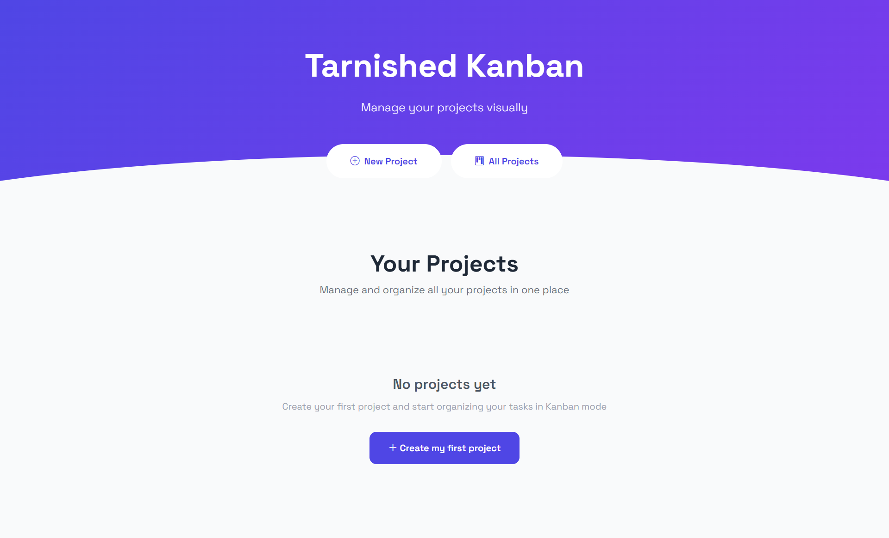
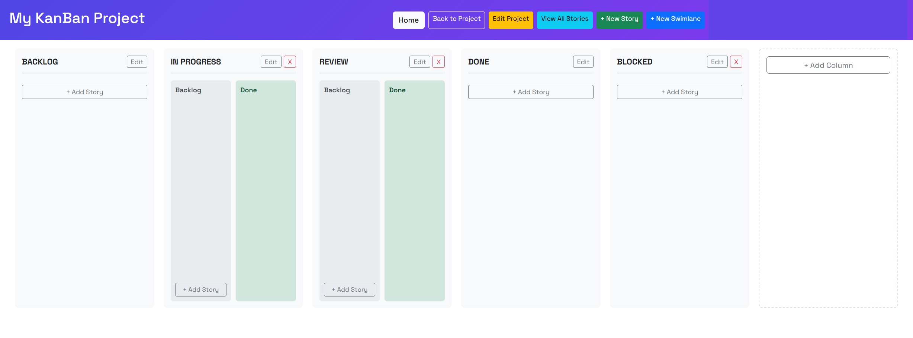
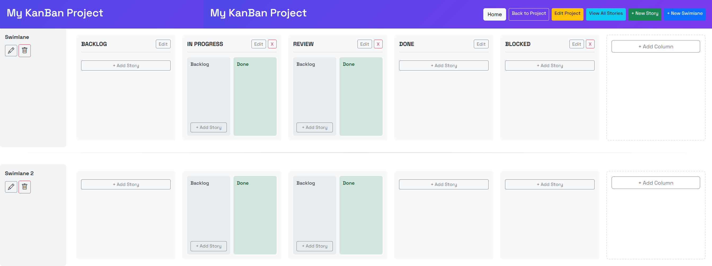
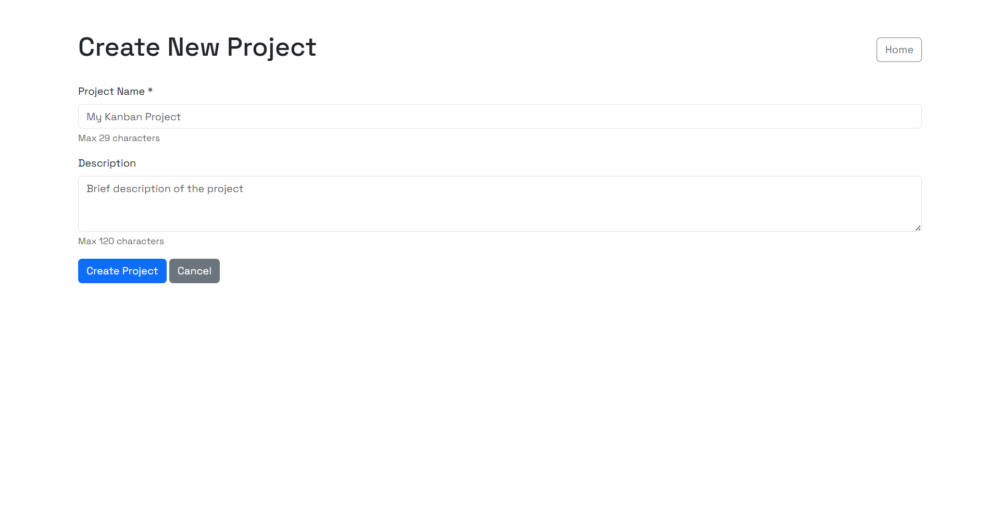
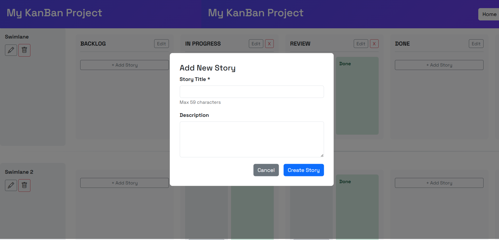
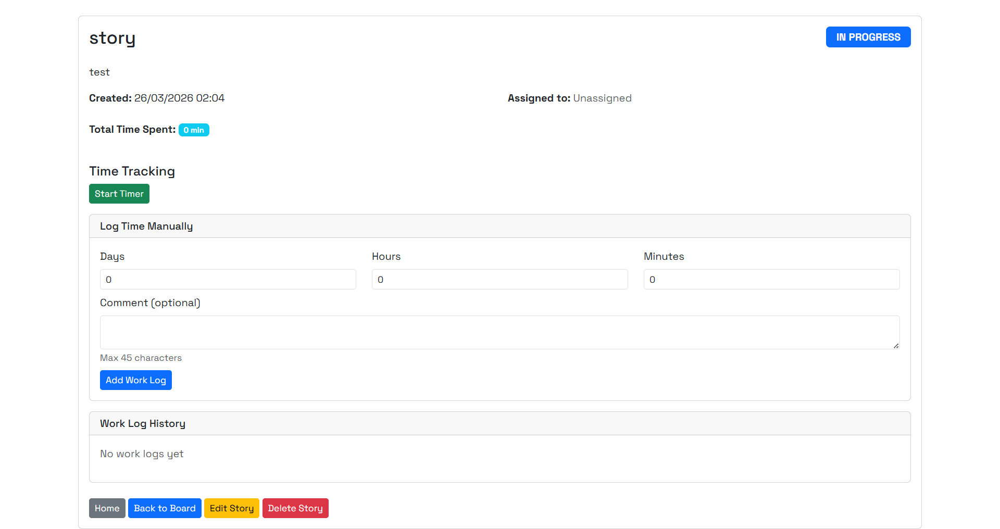
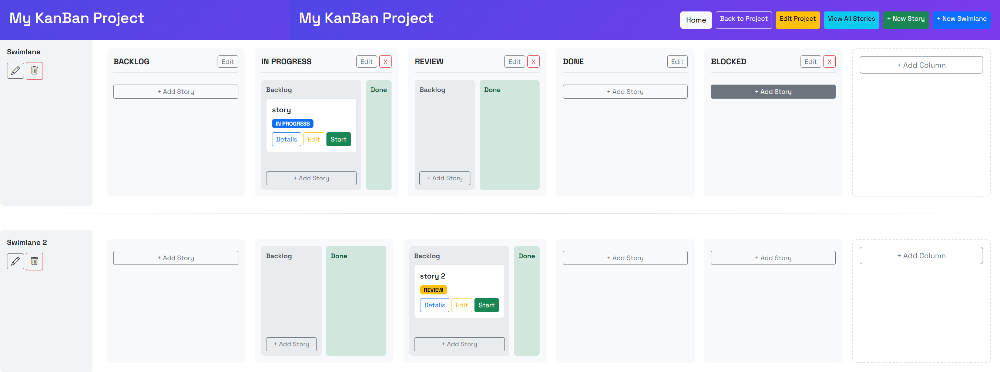

# KanBan Project

Simple Kanban web app built with Java and Spring MVC.

This project lets you create projects, manage stories, organize work with columns and swimlanes, and track time on each story.

## Screenshots

### Home



Entry page with quick access to project creation and project list.

### Kanban board



Main board view with columns, story movement, and quick actions.

### Board with swimlanes



Visual separation of workflows inside the same project.

### Create project



Project creation form with basic validation.

### Add story



Quick story creation directly from the board.

### Story details and timer



Story page with timer start/stop and worklog history.

### Workflow example



Example of story progression across columns.

## Main features

- Create, edit, and delete projects.
- Automatic default columns: BACKLOG, IN PROGRESS, REVIEW, DONE, BLOCKED.
- Drag and drop stories between columns.
- Custom columns with max capacity (WIP limit).
- Backlog/Done sub-columns in selected columns.
- Swimlanes per project.
- Story management: create, edit, delete, assign.
- Time tracking: timer + manual worklogs.
- Unit and integration tests.

## Tech stack

- Java 17
- Maven (multi-module)
- Spring MVC 5
- Thymeleaf
- Bootstrap 5
- In-memory repository layer (no SQL database)
- JUnit 5, Mockito, Selenium, WebDriverManager
- JaCoCo, SpotBugs, PITest

## Project structure

```text
gestiondetaches/
├── tarnished/
│   ├── project-model/      # domain entities
│   ├── project-repomem/    # in-memory repositories
│   └── project-app/        # controllers + web views
├── screenshots/            # README screenshots
├── .gitignore
├── .gitlab-ci.yml
└── README.md
```

## Setup and run

### Prerequisites

- Java 17
- Maven 3.9+

### Build

From `tarnished`:

```bash
mvn clean install
```

### Run

From `tarnished/project-app`:

```bash
mvn jetty:run
```

Open:

- http://localhost:8080/gl2526-tarnished

Staging live demo (short info):

- https://staging.cluster.ensisa.uha.fr/gl2526-tarnished/
- This staging server may be unavailable depending on server status.

### Tests

From `tarnished`:

```bash
mvn test
```

Integration tests:

```bash
mvn verify
```

## Portfolio integration

Target portfolio repository:

- https://github.com/ZakBZD100/Portfolio

Portfolio-ready summary:

Short description:

Kanban web application in Java (Spring MVC) to manage projects and stories with an interactive board, swimlanes, and built-in time tracking.

Stacks:

Java 17, Spring MVC, Thymeleaf, Bootstrap, Maven, JUnit, Mockito, Selenium.

Project role:

Software engineering project focused on domain modeling, multi-module architecture, and test-driven quality checks.

## GitHub configuration

### Start coding with Codespaces

This project can be started in GitHub Codespaces.

After opening the workspace:

- Check Java 17 and Maven.
- Run `mvn clean install` in `tarnished`.
- Run `mvn jetty:run` in `tarnished/project-app`.

### Add collaborators

In GitHub repository settings:

- Go to Settings > Collaborators and teams.
- Add collaborators using GitHub username or email.

### Quick setup

Repository URL:

- https://github.com/ZakBZD100/KanBan-Project.git

Create a new repository:

```bash
echo "# KanBan-Project" >> README.md
git init
git add README.md
git commit -m "first commit"
git branch -M main
git remote add origin https://github.com/ZakBZD100/KanBan-Project.git
git push -u origin main
```

Push an existing project:

```bash
git remote add origin https://github.com/ZakBZD100/KanBan-Project.git
git branch -M main
git push -u origin main
```

## Contributors

- Zakariae El Bouzidi
- Nabil Dahmani
- Hamza Fikri
- Moncef Hiam
- Louay BEN El Toufa

## License

This project is distributed under the MIT License. See the LICENSE file.

Zakariae El Bouzidi 2026

